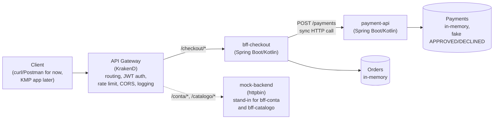
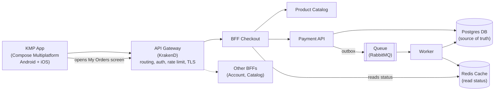

# iStore Back-end

Architecture exercise "Checkout KMP + BFF": API Gateway + Checkout
backend. Gateway is **KrakenD** (declarative config, no custom code);
`bff-checkout` and `payment-api` are **Spring Boot (Kotlin)**, Phase 2
of the roadmap — synchronous backend, no queue/worker/Postgres yet.

## Architecture

### Current state (implemented)

Gateway + `bff-checkout` + `payment-api`, all synchronous, in-memory
storage, no queue yet. `bff-conta` and `bff-catalogo` don't exist —
`mock-backend` (httpbin) stands in for them.



No queue, no worker, no Postgres, no Redis yet — `payment-api` decides
approve/decline immediately and synchronously (see "Known
simplifications" in each service's README). This is Phase 2 of the
roadmap.

### Target state (roadmap)

Where this is headed: async payment processing via outbox + queue +
worker + cache, Postgres as the source of truth, and the real KMP app
instead of curl/Postman.



Gaps between current and target state, roughly in build order:

- Health checks in `docker-compose.yml` so `depends_on` actually waits
  for the app to be ready, not just the container to start.
- Real `bff-conta` (and possibly `bff-catalogo`), replacing
  `mock-backend`.
- Phase 3: RabbitMQ queue + Worker + Redis cache, replacing the
  synchronous fake decision in `payment-api`.
- Phase 4: Postgres as the source of truth + outbox pattern + DLQ +
  end-to-end idempotency.
- Phase 5 (stretch goal): push notification when a payment finishes
  processing.

## What this repo covers right now

- **Gateway** (KrakenD): routes to `bff-checkout` for the checkout flow,
  and to a mock backend (`httpbin`) for `/conta` and `/catalogo`, which
  still don't exist as real services.
- **bff-checkout** (Spring Boot/Kotlin): `GET /produtos`,
  `POST /checkout`, `GET /pedidos`. Calls `payment-api` synchronously.
- **payment-api** (Spring Boot/Kotlin): `POST /payments`,
  `GET /payments/{id}`. Fake synchronous approve/decline decision,
  in-memory storage.

Cross-cutting concerns on the Gateway:

- **Routing**: one endpoint per business route (`/checkout/produtos`,
  `POST /checkout`, `/checkout/pedidos`, `/conta/perfil`,
  `/catalogo/produtos`), each with its own `backend.host`.
- **Auth**: JWT (RS256) validation via a local JWK, on the endpoints
  that make sense to require an authenticated user (`POST /checkout`,
  `GET /checkout/pedidos`, `/conta/perfil`). `/checkout/produtos` and
  `/catalogo/produtos` stay public (catalog).
- **Rate limiting**: per endpoint (`max_rate`) and per IP
  (`client_max_rate`), on the authenticated endpoints.
- **Logging**: edge structured logging enabled (`telemetry/logging`).

## Why KrakenD Enterprise wasn't used for auth

The original doc treated "auth" as a generic Gateway concern. The most
direct way to do this in **KrakenD Community Edition** (open source, no
license) is **JWT validation via JWKS** (`auth/validator`), which is
what this repo uses. The ready-made **API Key** plugin
(`auth/api-keys`) is Enterprise-only — if it ever makes sense to migrate
to it, it's just a matter of swapping the `extra_config` of the
endpoints.

Since there's no real auth server in this exercise yet, the repo
includes a local test JWK (`gateway/jwk/public.json`) and a script
(`scripts/gen_test_jwt.py`) that signs test tokens with the matching
private key — just to validate the flow locally. Once a real auth
server exists, swap the local JWK for theirs.

## Why no Gradle wrapper in bff-checkout / payment-api

Both services build with a **multi-stage Dockerfile**
(`gradle:8.10-jdk21` for the build stage, `eclipse-temurin:21-jre` for
the runtime image), so Gradle only needs to exist inside Docker — not
on your machine. `docker compose up --build` is enough; you don't need
JDK 21 or Gradle installed locally unless you want to run a service
outside Docker (see each service's README for that).

## Structure

```
iStore-gateway/
├── docker-compose.yml       # gateway + bff-checkout + payment-api + mock backend
├── gateway/
│   ├── krakend.json         # Gateway declarative config
│   └── jwk/public.json      # test public key (JWT)
├── scripts/
│   ├── gen_test_jwt.py      # generates a test JWT (uses private.pem)
│   └── private.pem          # test private key — NOT for prod
└── services/
    ├── bff-checkout/        # Spring Boot (Kotlin), Phase 2
    ├── payment-api/         # Spring Boot (Kotlin), Phase 2
    └── bff-conta/           # placeholder, not implemented yet
```

## How to run

```bash
docker compose up --build
```

- Gateway: `http://localhost:8080` (single entry point, use this one)
- bff-checkout direct: `http://localhost:8081` (debug only, Swagger UI at `/swagger-ui.html`)
- payment-api direct: `http://localhost:8090` (debug only, Swagger UI at `/swagger-ui.html`)
- mock backend (httpbin, for `/conta` and `/catalogo`): `http://localhost:8082`

Swagger is only reachable by hitting a service directly (the Gateway
doesn't proxy `/swagger-ui.html` or `/v3/api-docs`), and it's on by
default in this compose setup since there's no `SPRING_PROFILES_ACTIVE`
set. See "Swagger / OpenAPI" below for how it's disabled in prod.

## How to test

Public route (catalog), no token:

```bash
curl http://localhost:8080/checkout/produtos
```

Protected route without a token — should return `401`:

```bash
curl -i http://localhost:8080/checkout/pedidos
```

Full checkout flow with a token:

```bash
pip install pyjwt --break-system-packages
cd scripts
TOKEN=$(python3 gen_test_jwt.py)
cd ..

curl -H "Authorization: Bearer $TOKEN" \
  -H "Content-Type: application/json" \
  -X POST http://localhost:8080/checkout \
  -d '{"items":[{"productId":"prod-1","quantity":2}],"idempotencyKey":"test-key-1"}'

curl -H "Authorization: Bearer $TOKEN" http://localhost:8080/checkout/pedidos
```

Rate limit (`client_max_rate=3` on `POST /checkout`) — fire more than 3
requests per second from the same IP and expect `429` starting on the
fourth:

```bash
for i in 1 2 3 4 5; do
  curl -s -o /dev/null -w "%{http_code}\n" \
    -X POST -H "Authorization: Bearer $TOKEN" \
    -H "Content-Type: application/json" \
    -d '{"items":[{"productId":"prod-1","quantity":1}],"idempotencyKey":"rl-test-'"$i"'"}' \
    http://localhost:8080/checkout
done
```

## Swagger / OpenAPI

Both `bff-checkout` and `payment-api` ship `springdoc-openapi`
(Swagger UI + `/v3/api-docs`), **on by default**. This is controlled by
a Spring profile, not a code branch:

- `application.yml` — `springdoc.api-docs.enabled: true`,
  `springdoc.swagger-ui.enabled: true` (default/dev).
- `application-prod.yml` — both `false`. Activate it with
  `SPRING_PROFILES_ACTIVE=prod` (e.g. as an env var on the container)
  to turn Swagger off in a real deployment.

`docker-compose.yml` doesn't set `SPRING_PROFILES_ACTIVE`, so Swagger
stays on for local/dev use. When these services are actually deployed
somewhere real, set `SPRING_PROFILES_ACTIVE=prod` on that environment.

## Next steps (roadmap)

See the "Target state (roadmap)" diagram above. Phase 4 adds Postgres,
outbox pattern, the RabbitMQ queue, the worker, and idempotency/DLQ
hardening — `payment-api` and `bff-checkout` currently only cover
Phase 2 (synchronous, in-memory, fake decision).
